# Indigo-Dynamic-Adapter

## 목차

1. [프로젝트 배경](#프로젝트-배경)
2. [프로젝트 개요](#프로젝트-개요)
3. [아키텍처 개요](#아키텍처-개요)
4. [핵심 구성 요소](#핵심-구성-요소)
5. [주요 기능](#주요-기능)
6. [Service 구현](#service-구현)
7. [설계 구조](#설계-구조)
8. [개발 환경 설정](#개발-환경-설정)
9. [설정 파일 구조](#설정-파일-구조)
10. [작업 이력](#작업-이력)
11. [참고 자료](#참고-자료)
12. [부록](#부록)

---

## 프로젝트 배경

### 프로젝트 요약

Indigo-Dynamic-Adapter는 **TIBCO BusinessWorks를 자사 솔루션으로 대체하는 윈백 프로젝트**에서 개발되었습니다. 인력 부족, 짧은 프로젝트 기간, 자사 솔루션으로 대체 불가한 기능 문제를 해결하기 위해 **컴포넌트 조립 방식의 연계 어댑터**를 개발하여 다음 성과를 달성했습니다:

- 🔵**생산성 50% 이상 증대** → 정해진 기간 내 프로젝트 완수의 핵심 역할
- 🔵**기존 프로세스를 100% 동일하게 대체**
- 🔵**성능/속도는 TIBCO BW와 동일 수준으로 유지**
- 🔵고객 담당 부서의 **인터페이스 확장성·유지보수성 극대화**

### 프로젝트 개요

윈백 프로젝트의 배경은 다음과 같습니다:

- 🔵**TIBCO BusinessWorks(TIBCO BW)를 자사 솔루션으로 대체** → 윈백 프로젝트
- 🔵**TIBCO BW의 높은 유지보수 비용** → 고객사의 연간 유지비용 부담
- 🔵**TIBCO BW을 담당하던 직원의 퇴사로 인한 전담 관리 인력 부재** → 인터페이스 현황 파악 불가
- 🔵**외산 솔루션의 특성 상 원활하지 않은 지원 문제** → 인터페이스 관리 및 추가 어려움

### 프로젝트 수행 과정

#### 1. 분석 (08.19 ~ 09.02)

윈백 프로젝트는 **AS-IS 분석이 매우 중요**합니다. 기존 시스템의 구조, 로직, 의존성 등을 정확히 파악하는 것이 핵심이며, 새로운 소프트웨어로 호환성·성능·데이터정합성/무결성 문제 없이 동일하게 대체해야 합니다.

분석 과정을 통해 다음 내용을 파악했습니다:

- 🔴**리눅스·JDK 1.7 버전**: 2016년 TIBCO BW 부분 전환을 위해 설치되었던 자사 솔루션과의 호환을 위해 이미 설치된 JDK 1.7 버전을 그대로 사용해야 함
- 🔴**628개가 넘는 개수의 인터페이스** → 미대상·중복을 간추려 최종 215개의 목록 도출
- 🔴**연계 대상 15개 시스템의 접속 정보 및 환경 조사 완료** (JDBC 접속정보, 권한, FTP 서버 접속 정보 등)
- 🔴연계 솔루션 서버와 연계대상 서버 간 방화벽 여부 확인 및 추가 허용 요청
- 🔴**TIBCO BW 설정 및 영문 매뉴얼 분석&해석** → 상세한 AS-IS 프로세스 조사/정리
- 🔴**데이터 변환/매핑·조건 분기·무결성 검증 로직이 포함된 복잡한 경우가 다수**

#### 2. 문제 인식

분석 과정에서 맞닥뜨린 문제들:

- ⚠️**인력 부족** → 약 4개월 간의 프로젝트에서 관리/개발 등 전 과정을 홀로 완수해야 함
- ⚠️**복잡한 프로세스, 많은 개수의 인터페이스**
- ⚠️**자사 솔루션의 한계**
  - 기본 내장 어댑터는 비즈니스 로직 수준의 복잡한 데이터 연계를 미지원
- ⚠️표준화를 하기에는 **기존 프로세스의 다양성이 상당히 큼**
- ⚠️표준화 포기·하드코딩 시 유지보수 및 신규 개발 어려움

🚨→ 높은 난이도와 프로젝트 지연 가능성

#### 3. 목표 설정 및 의사 결정

🎯**목표**:
- 🟢정해진 기간 내 프로젝트 완수
- 🟢고객 담당 부서의 인터페이스 관리 어려움 문제 해결
- 🟢자사 솔루션 기반에서 고객이 직접 인터페이스를 개발할 수 있는 플랫폼 제공

**의사 결정**:

> 🟢TIBCO BW의 Activity 조립 구조를 벤치마킹, 조합형 컴포넌트 기반 워크플로우 생성 방식 어댑터 개발을 결정
>
> → Low-Code 방식 어댑터를 만들어 생산성도 높이고 개발·관리를 쉽게 하자!

---

## 프로젝트 개요

Indigo-Dynamic-Adapter는 INDIGO ESB 솔루션을 기반으로 작동하는 데이터 연계 모듈입니다. 이 모듈은 DB, FTP, 파일, HTTP, JMS 등 다양한 프로토콜 간 데이터 연계 프로세스를 지원하며, Spring Bean XML 문법을 활용하여 컴포넌트 조합 방식으로 손쉽게 데이터 연계 프로세스를 개발할 수 있습니다.

**컴포넌트 조립 방식**은 TIBCO BusinessWorks의 Activity 조립 구조를 벤치마킹하여 개발되었으며, Low-Code 방식으로 인터페이스 개발 생산성을 향상시키고 유지보수성을 극대화합니다.

기본 아키텍쳐


서비스(기능) 컴포넌트 조합 예시


### 주요 특징

- 🔵**유연성**: 다양한 프로토콜과 데이터 소스 지원
- 🔵**확장성**: 컴포넌트 조합 방식으로 프로세스 구성
- 🔵**유지보수성**: 설정 기반 개발로 코드 수정 최소화
- 🔵**Dynamic-Code 기능**: 웹 콘솔에서 직접 Java 코드를 작성하고 운영 환경에 즉시 배포 가능
- 🔵**트랜잭션 관리**: DB 작업 시 자동 트랜잭션 관리 및 롤백 지원
- 🔵**에러 처리**: 체계적인 에러 핸들링 및 복구 메커니즘

---

## 아키텍처 개요

Indigo-Dynamic-Adapter는 다음과 같은 요소로 구성되었습니다:

```
┌───────────────────────────────────────────────────────────┐
│                        Dispatcher                         │
│  (SimpleDispatcher, HttpRequestDispatcher)                │
└───────────────────────────────────────────────────────────┘
                       
┌───────────────────────────────────────────────────────────┐
│                     Service Processor                     │
│  (ServiceProcessor: Service-Chaining, Error-Handling)     │
└───────────────────────────────────────────────────────────┘
                       
┌───────────────────────────────────────────────────────────┐
│                        Service                            │
│  (DB, FTP, File, HTTP, Dynamic Code Services)             │
└───────────────────────────────────────────────────────────┘
                     
┌───────────────────────────────────────────────────────────┐
│                  Storage & Provider                       │
│  (StorageManager, DataSourceProvider, FTPSourceProvider)  │
└───────────────────────────────────────────────────────────┘
```


### 데이터 흐름

```mermaid
flowchart TD
    A[인터페이스 이벤트 발생] --> B[Dispatcher가 이벤트 수신]
    B --> C[StorageManager에서 InterfaceInfo 조회]
    C --> D["ServiceContext 생성<br/>(txId, 시작시간 등 초기화)"]
    D --> E[ServiceProcessor.unfoldServices 호출]
    E --> F[Service-Chaining 실행]
    
    F --> G["각 Service: Input 데이터 조회<br/>(ServiceContext에서)"]
    G --> H[Service 기능 수행]
    H --> I["결과를 ServiceContext에<br/>Output으로 저장"]
    I --> J{다음 Service 존재?}
    J -->|예| G
    J -->|아니오| K{에러 발생?}
    
    K -->|예| L[Error-Handling 실행]
    L --> M[ErrorHandler 조회]
    M --> N["에러 처리 전략 실행<br/>(Rollback, 알림, 대체 경로 등)"]
    N --> O[Callback 실행]
    
    K -->|아니오| O
    O --> P[TransactionCleanupCallback]
    P --> Q[SessionCleanupCallback]
    Q --> R[커스텀 Callback]
    R --> S[ServiceContext 소멸]
```




---

## 핵심 구성 요소

### 1. Dispatcher (분배기)

인터페이스 이벤트를 수신하고 해당 인터페이스 ID와 매핑된 프로세스를 호출하는 역할을 수행합니다.

#### 주요 클래스

- 🔵**`SimpleDispatcher`**: 기본 인터페이스 이벤트 분배기
  - `interfaceId`를 파라미터로 받아 `InterfaceInfo`를 조회
  - 인터페이스 활성화 여부 확인
  - `ServiceContext` 생성 및 `ServiceProcessor` 호출
  - 스케쥴 작업 등에서 `SimpleDispatcher`를 호출하여 인터페이스 프로세스 시작 가능

- 🔵**`HttpRequestDispatcher`**: HTTP 요청 기반 분배기
  - HTTP 요청 URL과 Method를 기반으로 `InterfaceInfo` 매핑
  - HTTP 헤더, 파라미터, 바디를 `ServiceContext`에 저장
  - HTTP 응답 처리 및 반환

### 2. Service Processor (서비스 프로세서)

프로세스를 실제로 수행하는 핵심 모듈로, `ServiceProcessor.unfoldServices(ServiceContext)` 메소드를 통해 Service-Chaining, Error-Handling, Callback을 순차적으로 실행합니다.

#### Service-Chaining (서비스 체이닝)

**실행 프로세스**:
1. `InterfaceInfo`에서 `serviceId`를 조회하여 Service-Strategy 목록을 가져옵니다.
2. 각 Service를 순차적으로 실행하며, 실행 전 `processOn` 플래그를 확인합니다.
3. 각 Service 실행 전후로 `ServiceTrace`에 실행 이력을 기록합니다.
4. Service 실행 중 예외 발생 시:
   - `ignoreError`가 `true`인 경우: 에러를 무시하고 다음 Service로 진행
   - `ignoreError`가 `false`인 경우: `ErrorTrace`에 에러 정보를 기록하고 Error-Handling 단계로 이동
5. Service 실행 후 `processOn` 플래그가 `false`로 변경된 경우 Service-Chaining을 중단합니다.
6. 각 Service의 성공/실패 여부에 따라 `ProcessCode`를 업데이트합니다:
   - 정상 종료: `SUCCESS`
   - 강제 실패: `ENFORCED_FAILURE` → `FAILURE`로 변경
   - 에러 발생: `FAILURE`


**주요 특징**:
- **Service Trace**: 실행된 Service 클래스 목록을 `ServiceContext`에 저장하여 디버깅 및 모니터링 지원
- **프로세스 제어**: `ServiceContext.processOn` 플래그를 통해 Service-Chaining 중단 가능
- **에러 무시 옵션**: Service별 `ignoreError` 설정으로 특정 Service의 에러를 무시하고 계속 진행 가능
- **상태 추적**: 각 Service 실행 시점의 시작/종료 시간을 `ServiceContext.endTime`에 기록

#### Error-Handling (에러 처리)

**실행 프로세스**:
1. Service-Chaining 중 `Throwable` 예외가 발생하면 catch 블록으로 이동합니다.
2. `InterfaceInfo`의 `errorHandlerId`를 통해 등록된 Error-Handler 목록을 조회합니다.
3. 각 Error-Handler의 `isTriggered(Throwable.class)` 메소드를 호출하여 해당 예외 타입에 대해 트리거 여부를 확인합니다.
4. 트리거된 Error-Handler만 순차적으로 실행합니다.
5. Error-Handler 실행 중에도 예외가 발생할 수 있으며, 이 경우 다음 Error-Handler로 계속 진행합니다.
6. 모든 Error-Handler 실행 후 Callback 단계로 이동합니다.

**주요 특징**:
- **예외 타입별 처리**: `ErrorHandler.isTriggered()` 메소드를 통해 특정 예외 타입에만 반응하도록 설정 가능
- **다중 Error-Handler 지원**: 여러 Error-Handler를 등록하여 다양한 에러 상황에 대응 가능
- **에러 추적**: `ServiceContext.addErrorTrace()`를 통해 에러 발생 위치와 상세 정보를 기록
- **Error-Handler 내부 서비스 호출**: Error-Handler 내에서도 다른 Service를 호출하여 복구 작업 수행 가능
- **Error Query/Dynamic Code Sequence**: 에러 처리 시 별도의 쿼리 시퀀스와 동적 코드 시퀀스 실행 가능

**ErrorHandler 인터페이스**:
```java
public interface ErrorHandler {
    // 예외 타입에 따라 트리거 여부 결정
    boolean isTriggered(Class<? extends Throwable> clazz);
    
    // 에러 처리 로직 수행
    void handleError(ServiceContext ctx) throws Throwable;
}
```

#### Callback (콜백)

**실행 프로세스**:
1. Service-Chaining과 Error-Handling이 모두 완료된 후 `finally` 블록에서 실행됩니다.
2. 등록된 모든 `AfterProcessCallback`을 순차적으로 실행합니다.
3. 각 Callback 실행 중 예외가 발생해도 다음 Callback 실행에 영향을 주지 않습니다.

**기본 Callback**:

1. **TransactionCleanupCallback** (`mb.dnm.core.callback.TransactionCleanupCallback`):
   - `ServiceContext`의 모든 `TransactionContext`를 순회합니다.
   - `constant` 플래그가 설정된 Executor는 정리 대상에서 제외됩니다.
   - 미종료된 트랜잭션이 있는 경우:
     - `ServiceContext.isErrorExist()`가 `true`이면 Rollback
     - `false`이면 Commit
   - Spring `TransactionSynchronizationManager`를 사용하여 트랜잭션 상태를 복원하고 정리합니다.
   - Constant Executor의 리소스는 `TransactionSynchronizationManager`에서 제거하지 않습니다.

2. **SessionCleanupCallback** (`mb.dnm.core.callback.SessionCleanupCallback`):
   - `ServiceContext`의 `sessionMap`에 저장된 모든 `ClosableStreamWrapper` 세션을 순회합니다.
   - 각 세션의 `close()` 메소드를 호출하여 리소스를 해제합니다.
   - 세션 정리 후 `sessionMap`을 비웁니다.

**커스텀 Callback 등록**:

`AfterProcessCallback` 인터페이스를 구현하여 커스텀 Callback을 등록할 수 있습니다:

```java
// 방법 1: 직접 등록
ServiceProcessor.addCallback(new CustomCallback());

// 방법 2: RegistrableProcessCallback 상속
public class CustomCallback extends RegistrableProcessCallback {
    @Override
    public void afterProcess(ServiceContext ctx) {
        // 커스텀 로직
    }
}
// 등록
new CustomCallback().register();
```

**Callback 실행 순서**:
1. TransactionCleanupCallback (기본)
2. SessionCleanupCallback (기본)
3. 등록된 커스텀 Callback들 (등록 순서대로)

### 3. Service Context (서비스 컨텍스트)

매 인터페이스 이벤트 발생 시마다 Dispatcher에서 생성되어 전체 프로세스를 관통하는 객체입니다. `ServiceContext`는 Service-Chaining 과정에서 메타데이터 및 Input/Output 데이터를 관리하고, 데이터 흐름과 상태를 유지하는 핵심 객체입니다.

#### 생성 및 초기화

**생성자**:
```java
public ServiceContext(InterfaceInfo info)
```

**초기화 항목**:
- `txId`: `TxIdGenerator.generateTxId()`로 생성된 고유 트랜잭션 ID
- `info`: 인터페이스 메타데이터 (`InterfaceInfo`)
- `startTime`: 생성 시점의 시간
- `processStatus`: `ProcessCode.NOT_STARTED`로 초기화
- `processOn`: `true`로 초기화
- `serviceTrace`: 빈 `ArrayList`로 초기화
- `innerServiceTraces`: 빈 `LinkedHashMap`으로 초기화 (IterationGroup 내부 서비스 추적용)
- `errorTrace`: 빈 `LinkedHashMap`으로 초기화
- `contextParams`: 빈 `HashMap`으로 초기화
- `txContextMap`: 빈 `HashMap`으로 초기화 (Executor별 트랜잭션 컨텍스트)
- `sessionMap`: 빈 `HashMap`으로 초기화 (FTP 세션 등)

#### 주요 속성

**기본 메타데이터**:
- `txId` (String): 트랜잭션 고유 ID (인터페이스 ID + 타임스탬프 기반)
- `info` (InterfaceInfo): 인터페이스 메타데이터
- `startTime` (Date): 프로세스 시작 시간
- `endTime` (Date): 프로세스 종료 시간 (각 Service 종료 시마다 업데이트)
- `processStatus` (ProcessCode): 프로세스 상태 코드
  - `NOT_STARTED`: 초기 상태
  - `IN_PROCESS`: Service-Chaining 진행 중
  - `SUCCESS`: 정상 완료
  - `FAILURE`: 에러 발생
  - `ENFORCED_FAILURE`: 강제 실패
- `processOn` (boolean): 프로세스 진행 여부 플래그 (`false`로 설정 시 Service-Chaining 중단)

**추적 정보**:
- `serviceTrace` (List<Class<? extends Service>>): 실행된 Service 클래스 목록
- `innerServiceTraces` (Map<Integer, InnerServiceTrace>): IterationGroup 내부 서비스 추적 정보
- `errorTrace` (Map<Class<? extends Service>, ErrorTrace>): 에러 발생 위치 및 상세 정보

**데이터 저장소**:
- `contextParams` (Map<String, Object>): Service 간 데이터 전달용 저장소
  - `addContextParam(String key, Object value)`: 단일 데이터 추가
  - `addContextParams(Map<String, Object> params)`: 여러 데이터 일괄 추가
  - `getContextParam(String key)`: 데이터 조회
  - `deleteContextParam(String key)`: 데이터 삭제

**트랜잭션 관리**:
- `txContextMap` (Map<String, TransactionContext>): Executor별 트랜잭션 컨텍스트
  - `setGroupTransaction(String executorName, boolean enabled)`: 그룹 트랜잭션 설정
  - `getTransactionContext(String executorName)`: 트랜잭션 컨텍스트 조회
  - `addTransactionContext(QueryMap queryMap)`: 쿼리 실행 시 자동으로 트랜잭션 컨텍스트 추가

**세션 관리**:
- `sessionMap` (Map<String, ClosableStreamWrapper>): FTP 세션 등 외부 리소스 세션
  - `addSession(String sourceName, ClosableStreamWrapper session)`: 세션 추가
  - `getSession(String sourceName)`: 세션 조회
  - `isSessionExist(String sourceName)`: 세션 존재 여부 확인

**시퀀스 관리**:
- `currentQueryOrder` (int): 현재 Query Sequence 인덱스
- `currentErrorQueryOrder` (int): 현재 Error Query Sequence 인덱스
- `currentDynamicCodeOrder` (int): 현재 Dynamic Code Sequence 인덱스
- `currentErrorDynamicCodeOrder` (int): 현재 Error Dynamic Code Sequence 인덱스

#### 주요 메소드

**시퀀스 관리 메소드**:
- `nextQueryMap()`: Query Sequence에서 다음 쿼리 `QueryMap` 조회 및 인덱스 증가
- `hasMoreQueryMaps()`: Query Sequence에 남은 쿼리 존재 여부 확인
- `getQueryMap(String id)`: 특정 queryId로 `QueryMap` 조회 (인덱스 증가 없음)
- `nextErrorQueryMap()`: Error Query Sequence에서 다음 쿼리 조회
- `hasMoreErrorQueryMaps()`: Error Query Sequence에 남은 쿼리 존재 여부 확인
- `nextDynamicCodeId()`: Dynamic Code Sequence에서 다음 codeId 조회
- `hasMoreDynamicCodes()`: Dynamic Code Sequence에 남은 코드 존재 여부 확인
- `nextErrorDynamicCodeId()`: Error Dynamic Code Sequence에서 다음 codeId 조회
- `hasMoreErrorDynamicCodes()`: Error Dynamic Code Sequence에 남은 코드 존재 여부 확인

**추적 메소드**:
- `addServiceTrace(Class<? extends Service> service)`: Service 실행 이력 추가
- `addServiceTraces(List<Class<? extends Service>> services)`: 여러 Service 실행 이력 일괄 추가
- `addInnerServiceTrace(int externalServiceIdx, int innerServiceIdx, Class<? extends Service> service)`: IterationGroup 내부 서비스 추적 추가
- `addErrorTrace(Class<? extends Service> service, Throwable throwable)`: 에러 추적 정보 추가
- `getServiceTraceMessage()`: Service Trace를 JSON 문자열로 반환
- `getServiceTraceMap()`: Service Trace를 Map 형태로 반환
- `getErrorTraceMessage()`: Error Trace를 JSON 문자열로 반환
- `getErrorTraceMap()`: Error Trace를 Map 형태로 반환 (쿼리 히스토리 포함)
- `isErrorExist()`: 에러 발생 여부 확인

**메타데이터 제공**:
- `getContextInformation()`: `ServiceContext`의 메타데이터를 Map 형태로 반환
  - `$tx_id`: 트랜잭션 ID
  - `$if_id`: 인터페이스 ID
  - `$tx_msg`: 메시지
  - `$process_status`: 프로세스 상태 코드 (P:진행중, S:정상, F:오류)
  - `$start_time_timestamp`: 시작 시간 [yyyyMMddHHmmssSSS]
  - `$start_time_date`: 시작 시간 [yyyyMMddHHmmss]
  - `$end_time_timestamp`: 종료 시간 [yyyyMMddHHmmssSSS]
  - `$end_time_date`: 종료 시간 [yyyyMMddHHmmss]
  - `$YYYY`, `$YYYYMM`, `$YYYYMMDD`, `$YYYYMMDDHHmmss`, `$HHmmss`, `$HHmm`: 현재 시간 정보
  - `$iter_position`: IterationGroup 내 현재 반복 위치
  - `$total_iter_position`: IterationGroup 내 총 반복 횟수

**시간 관리**:
- `stampEndTime()`: 종료 시간을 현재 시각으로 업데이트 (각 Service 종료 시 호출)

**프로세스 제어**:
- `setProcessOn(boolean processOn)`: 프로세스 진행 여부 설정
- `isProcessOn()`: 프로세스 진행 여부 확인
- `setProcessStatus(ProcessCode status)`: 프로세스 상태 코드 설정
- `getProcessStatus()`: 프로세스 상태 코드 조회

#### 트랜잭션 관리 상세

**TransactionContext**:
- Executor별로 독립적인 트랜잭션 컨텍스트를 관리합니다.
- `setGroupTransaction()` 메소드를 통해 여러 쿼리를 하나의 트랜잭션으로 묶을 수 있습니다.
- 쿼리 실행 시 `addTransactionContext()`가 자동으로 호출되어 쿼리 히스토리를 기록합니다.
- `TransactionCleanupCallback`에서 미종료 트랜잭션을 자동으로 Commit 또는 Rollback합니다.

**그룹 트랜잭션**:
- `StartTransaction` Service를 통해 그룹 트랜잭션을 시작합니다.
- 동일한 Executor에서 실행되는 여러 쿼리를 하나의 트랜잭션으로 묶어 처리합니다.
- `IterationGroup` 내에서도 쿼리 시퀀스가 소진되지 않도록 관리됩니다.

#### 세션 관리 상세

**FTP 세션 재사용**:
- `isSessionExist(String sourceName)` 메소드로 세션 존재 여부를 확인합니다.
- 세션이 존재하는 경우 재사용하고, 없으면 신규 생성합니다.
- `SessionCleanupCallback`에서 모든 세션을 자동으로 정리합니다.

**세션 타입**:
- `ClosableStreamWrapper` 인터페이스를 구현한 모든 객체를 세션으로 관리할 수 있습니다.
- 주로 FTP 세션 (`FTPClientTemplate`)에서 사용됩니다.

#### 시퀀스 관리 상세

**Query Sequence**:
- `InterfaceInfo.querySequence`에 정의된 쿼리 실행 순서를 관리합니다.
- `nextQueryMap()` 메소드로 순차적으로 쿼리를 조회하며, 인덱스가 자동으로 증가합니다.
- `getQueryMap(String id)` 메소드로 특정 queryId를 직접 조회할 수 있습니다 (인덱스 증가 없음).
- 쿼리 실행 시 `TransactionContext`에 쿼리 히스토리가 자동으로 기록됩니다.

**Dynamic Code Sequence**:
- `InterfaceInfo.dynamicCodeSequence`에 정의된 동적 코드 실행 순서를 관리합니다.
- `nextDynamicCodeId()` 메소드로 순차적으로 codeId를 조회합니다.
- `ExecuteDynamicCode` Service에서 사용됩니다.

**Error Query/Dynamic Code Sequence**:
- 에러 처리 시에만 사용되는 별도의 시퀀스입니다.
- `ErrorHandler` 내에서 `nextErrorQueryMap()`, `nextErrorDynamicCodeId()` 메소드를 사용합니다.
- 정상 프로세스의 시퀀스와 독립적으로 관리됩니다.

### 4. Storage Manager (스토리지 매니저)

인터페이스 정보, 서비스 전략, 에러 핸들러 등 static 정보를 저장하고 관리합니다.

#### 주요 기능

- **Interface Registry**: `InterfaceInfo` 객체 저장 및 조회
- **Service Registry**: Service-Strategy 저장 및 조회
- **Error Handler Registry**: Error-Handler 저장 및 조회
- **HTTP Request Mapping**: HTTP URL과 인터페이스 ID 매핑 관리
- **인터페이스 활성화/비활성화**: 운영 전환 시 순차 전환 지원

### 5. Interface Info (인터페이스 정보)

하나의 개별 인터페이스와 그 인터페이스가 처리해야 하는 Service-Strategy 및 Error-Handler에 대한 정보를 담고 있는 메타데이터입니다.

#### 주요 속성

- `interfaceId`: 인터페이스 고유 ID
- `serviceId`: 사용할 Service-Strategy ID
- `errorHandlerId`: 사용할 Error-Handler ID
- `querySequence`: DB 쿼리 실행 순서
- `dynamicCodeSequence`: 동적 코드 실행 순서
- `fileTemplates`: 파일/FTP 작업 설정 정보
- `sourceAliases`: DB/FTP/JMS 소스에 대한 별칭 매핑
- `activated`: 인터페이스 활성화 여부

### 6. Provider (제공자)

외부 리소스에 대한 접근 및 관리를 담당합니다.

#### DataSourceProvider

- DB 접속 및 쿼리 작업을 대행하는 `QueryExecutor` 저장 및 관리
- MyBatis 기반 쿼리 실행
- 트랜잭션 관리자 (`DataSourceTransactionManager`) 관리
- Executor별 트랜잭션 격리

#### FTPSourceProvider

- FTP 서버 접속 및 작업을 대행하는 `FTPClientTemplate` 저장 및 관리
- FTP 세션 생성 및 관리
- 한글 파일명 지원 (controlEncoding 설정)

#### DynamicCodeProvider

- 동적으로 실행 가능한 Java 코드인 `DynamicCode`의 저장/컴파일/접근 관리
- 런타임 컴파일 지원
- 멀티스레드 컴파일 지원

---

## 주요 기능

### 1. Dynamic-Code 기능

웹 콘솔에서 직접 Java 코드를 작성하고, 코드를 수동으로 컴파일/빌드/서버 업로드 하는 과정 없이 운영 환경에 바로 배포할 수 있는 기능입니다.

#### 특징

- 런타임 컴파일 지원
- 멀티스레드 컴파일 지원
- `ServiceContext` 접근 가능
- MyBatis Mapper 기능 활용 가능
- 자동 Import 처리
- 보안 검증 (금지된 키워드 체크)

#### 사용 예시

```java
#namespace: IF_TEST
#code_id: MAP_DATA
#{
    // ServiceContext에서 데이터 조회
    List<Map<String, Object>> inputData = ctx.getContextParam("input_data");
    
    // 데이터 변환 로직
    List<Map<String, Object>> outputData = new ArrayList<>();
    for (Map<String, Object> row : inputData) {
        Map<String, Object> transformed = new HashMap<>();
        transformed.put("id", row.get("old_id"));
        transformed.put("name", row.get("old_name"));
        outputData.add(transformed);
    }
    
    // ServiceContext에 결과 저장
    ctx.addContextParam("output_data", outputData);
}#
```

#### 구현 방식

Dynamic-Code 기능은 Java의 `javax.tools.JavaCompiler` API를 활용하여 런타임에 Java 코드를 컴파일하고 실행하는 방식으로 구현되었습니다.

**파일 구조 및 문법**:
- 파일 확장자: `.dnc` (Dynamic Code)
- 필수 요소: `#namespace:`, `#code_id:`, `#{ ... }#`
- 선택 요소: `#implements`, `#import`

**컴파일 프로세스**:
1. `.dnc` 파일 파싱
2. DynamicCodeHolder 생성
3. Java 소스 코드 생성 (템플릿 기반)
4. Java 컴파일러로 컴파일
5. URLClassLoader로 클래스 로드
6. DynamicCodeInstance 생성 및 실행

**주요 클래스**:
- `DynamicCodeCompiler`: 컴파일의 핵심 클래스 (Singleton 패턴)
- `DynamicCodeHolder`: 파싱된 정보를 담는 컨테이너
- `DynamicCodeInstance`: 실행 가능한 인스턴스
- `ImportSupporter`: 자동 Import 처리 및 보안 검증
- `AbstractDynamicCode`: 기본 Wrapper 클래스

자세한 구현 방식은 [Dynamic-Code 구현 방식 상세](#dynamic-code-구현-방식-상세) 섹션을 참고하세요.

### 2. 트랜잭션 관리

#### 그룹 트랜잭션

- 동일한 Executor에서 실행되는 여러 쿼리를 하나의 트랜잭션으로 묶어 처리
- `StartTransaction` Service를 통해 시작
- `IterationGroup` 내에서도 쿼리 시퀀스가 소진되지 않도록 관리

#### 트랜잭션 타임아웃

- `InterfaceInfo`의 `txTimeoutSecond` 속성으로 설정
- 쿼리별로 타임아웃 설정 가능

#### 자동 트랜잭션 관리

- `TransactionCleanupCallback`에서 미종료 트랜잭션을 자동으로 Commit 또는 Rollback
- 에러 발생 시 자동 Rollback
- Constant Executor는 트랜잭션 정리에서 제외 가능

### 3. FTP 세션 재사용

- `ServiceContext` 내에 이미 FTP 세션이 존재하는 경우 재사용
- 세션 재생성 방지로 성능 향상
- `SessionCleanupCallback`에서 미해제 세션 자동 정리

### 4. 파일명 패턴 필터

- `WildcardFileFilter`를 활용한 파일명 패턴 매칭
- 여러 와일드카드 패턴 지원
- 한글 파일명 지원 (controlEncoding 설정)

### 5. 인터페이스 활성화/비활성화

- 운영 전환 시 동일한 어댑터에 속한 인터페이스도 순차 전환 가능
- `StorageManager.activateInterface()` / `inactivateInterface()` 메소드 사용
- HTTP 요청을 통한 원격 제어 지원

### 6. 에러 처리 전략

- **Rollback**: 실패한 작업의 상태 복구 (DB 롤백 또는 파일 위치 원상복구)
- **알림**: 관리자에게 에러 알림
- **대체 경로**: 실패한 작업을 우회하거나 다른 서비스로 대체 실행
- **ErrorHandler에서 서비스 호출**: 에러 처리 중에도 다른 서비스 호출 가능

---

## Service 구현

Indigo-Dynamic-Adapter는 다양한 프로토콜과 기능을 지원하는 총 **40개 이상의 Service**를 제공합니다. 각 Service는 특정 기능을 수행하는 최소 단위의 컴포넌트로, Service-Chaining을 통해 조합하여 사용할 수 있습니다.


### Service 타입별 목록

#### DB 서비스 (10개)

1. **Select** (`mb.dnm.service.db.Select`): 데이터베이스 SELECT 쿼리 실행
2. **Insert** (`mb.dnm.service.db.Insert`): 데이터베이스 INSERT 쿼리 실행
3. **Update** (`mb.dnm.service.db.Update`): 데이터베이스 UPDATE 쿼리 실행
4. **Delete** (`mb.dnm.service.db.Delete`): 데이터베이스 DELETE 쿼리 실행
5. **CallProcedure** (`mb.dnm.service.db.CallProcedure`): 저장 프로시저 호출
6. **StartTransaction** (`mb.dnm.service.db.StartTransaction`): 트랜잭션 그룹 시작
7. **Commit** (`mb.dnm.service.db.Commit`): 트랜잭션 커밋
8. **Rollback** (`mb.dnm.service.db.Rollback`): 트랜잭션 롤백
9. **EndTransaction** (`mb.dnm.service.db.EndTransaction`): 트랜잭션 자동 종료
10. **OpenCursor** (`mb.dnm.service.db.OpenCursor`): 커서 열기 (Fetch와 연계 사용)

#### FTP 서비스 (7개)

1. **FTPLogin** (`mb.dnm.service.ftp.FTPLogin`): FTP 서버 로그인
2. **FTPLogout** (`mb.dnm.service.ftp.FTPLogout`): FTP 서버 로그아웃
3. **ListFiles** (`mb.dnm.service.ftp.ListFiles`): FTP 서버 파일/디렉터리 목록 조회
4. **DownloadFiles** (`mb.dnm.service.ftp.DownloadFiles`): FTP 서버에서 파일 다운로드
5. **UploadFiles** (`mb.dnm.service.ftp.UploadFiles`): FTP 서버에 파일 업로드
6. **MoveFiles** (`mb.dnm.service.ftp.MoveFiles`): FTP 서버 내 파일 이동
7. **DeleteFiles** (`mb.dnm.service.ftp.DeleteFiles`): FTP 서버 파일/디렉터리 삭제

#### 파일 서비스 (6개)

1. **ReadFile** (`mb.dnm.service.file.ReadFile`): 파일 읽기
2. **WriteFile** (`mb.dnm.service.file.WriteFile`): 파일 쓰기
3. **ListFiles** (`mb.dnm.service.file.ListFiles`): 파일/디렉터리 목록 조회
4. **CopyFiles** (`mb.dnm.service.file.CopyFiles`): 파일 복사
5. **MoveFiles** (`mb.dnm.service.file.MoveFiles`): 파일 이동
6. **DeleteFiles** (`mb.dnm.service.file.DeleteFiles`): 파일/디렉터리 삭제

#### 일반 서비스 (12개)

1. **IterationGroup** (`mb.dnm.service.general.IterationGroup`): 반복 그룹 (반복문 수행)
2. **TransformData** (`mb.dnm.service.general.TransformData`): 데이터 타입 변환
3. **GetSize** (`mb.dnm.service.general.GetSize`): 데이터 크기 조회
4. **PrintInput** (`mb.dnm.service.general.PrintInput`): 입력 데이터 출력 (디버깅용)
5. **StopIfInputIsNullOrEmpty** (`mb.dnm.service.general.StopIfInputIsNullOrEmpty`): 입력이 null이거나 비어있으면 프로세스 중단
6. **PauseProcess** (`mb.dnm.service.general.PauseProcess`): 프로세스 일시 중지
7. **BreakIteration** (`mb.dnm.service.general.BreakIteration`): 반복문 중단
8. **ContinueIteration** (`mb.dnm.service.general.ContinueIteration`): 반복문 계속
9. **ControlInterfaceActivation** (`mb.dnm.service.general.ControlInterfaceActivation`): 인터페이스 활성화/비활성화 제어
10. **ThrowException** (`mb.dnm.service.general.ThrowException`): 예외 발생
11. **OutputCustomData** (`mb.dnm.service.general.OutputCustomData`): 커스텀 데이터 출력

#### 암호화 서비스 (2개)

1. **Encrypt** (`mb.dnm.service.crypto.Encrypt`): 데이터 암호화 (SEED128, ARIA128, JASYPT 지원)
2. **Decrypt** (`mb.dnm.service.crypto.Decrypt`): 데이터 복호화

#### 동적 코드 서비스 (1개)

1. **ExecuteDynamicCode** (`mb.dnm.service.dynamic.ExecuteDynamicCode`): 동적으로 컴파일된 Java 코드 실행

#### HTTP 서비스 (1개)

1. **SetHttpResponseBody** (`mb.dnm.service.http.SetHttpResponseBody`): HTTP 응답 바디 설정

### Service 구현 패턴

모든 Service는 일관된 구현 패턴을 따릅니다. 새로운 Service를 개발하거나 기존 Service의 구조를 이해하기 위해 다음 패턴들을 참고할 수 있습니다.

#### 상속 계층 구조

```
Service (인터페이스)
  └── AbstractService (추상 클래스)
      ├── ParameterAssignableService (추상 클래스)
      │   ├── SourceAccessService (추상 클래스)
      │   │   └── AbstractFTPService (추상 클래스)
      │   │       └── FTP 서비스들
      │   └── 파일/일반 서비스들
      └── DB 서비스들
```

#### 공통 구현 패턴

**1. process 메소드 구현 패턴**:
```java
@Override
public void process(ServiceContext ctx) throws Throwable {
    // 1. Input 데이터 조회
    Object inputData = getInputValue(ctx);
    
    // 2. 입력 검증
    if (inputData == null) {
        throw new InvalidServiceConfigurationException(...);
    }
    
    // 3. Service 로직 수행
    Object outputData = performServiceLogic(inputData, ctx);
    
    // 4. Output 데이터 저장
    if (getOutput() != null) {
        setOutputValue(ctx, outputData);
    }
}
```

**2. Input/Output 처리**:
- `ParameterAssignableService`를 상속한 경우 `getInputValue(ctx)`, `setOutputValue(ctx, value)` 사용
- 직접 `ServiceContext`에서 조회/저장: `ctx.getContextParam(key)`, `ctx.addContextParam(key, value)`

**3. 에러 처리**:
- `InvalidServiceConfigurationException` 사용 (설정 오류)
- `ignoreError` 속성으로 에러 무시 가능
- `exceptionHandlingMode`로 Error Query/Dynamic Code Sequence 사용 가능

**4. 로깅**:
```java
@Slf4j
public class CustomService extends AbstractService {
    @Override
    public void process(ServiceContext ctx) throws Throwable {
        String txId = ctx.getTxId();
        log.info("[{}]Service 시작", txId);
        // 로직 수행
        log.info("[{}]Service 완료", txId);
    }
}
```

#### 서비스 타입별 구현 패턴

**DB 서비스 패턴**:
1. QueryMap 조회 (`nextQueryMap()` 또는 `getQueryMap(queryId)`)
2. QueryExecutor 조회
3. TransactionContext 관리
4. 쿼리 실행
5. 결과 처리 및 저장

**FTP 서비스 패턴**:
1. `AbstractFTPService` 상속
2. FTP 세션 조회 (`getFTPSession()`)
3. FTP 작업 수행
4. 에러 처리

**파일 서비스 패턴**:
1. `SourceAccessService` 상속
2. `FileTemplate` 조회
3. 파일 경로 처리
4. 파일 작업 수행

자세한 구현 패턴은 [Service 구현 패턴 상세](#service-구현-패턴-상세) 섹션을 참고하세요.

---

## 설계 구조

### 패키지 구조

```
mb.dnm
├── access          # 외부 리소스 접근 계층
│   ├── crypto      # 암호화 관련
│   ├── db          # 데이터베이스 접근
│   ├── dynamic     # 동적 코드 관리
│   ├── file        # 파일 접근
│   ├── ftp         # FTP 접근
│   └── http        # HTTP 접근
├── code            # 코드 상수 및 열거형
├── core            # 핵심 기능
│   ├── callback    # 콜백 인터페이스 및 구현
│   ├── context     # 서비스 컨텍스트
│   └── dynamic     # 동적 코드 컴파일러
├── dispatcher      # 이벤트 분배기
│   └── http        # HTTP 요청 분배기
├── exeption        # 예외 처리
│   └── handler     # 예외 핸들러
├── service         # 서비스 구현
│   ├── crypto      # 암호화 서비스
│   ├── db          # DB 서비스
│   ├── dynamic     # 동적 코드 서비스
│   ├── file        # 파일 서비스
│   ├── ftp         # FTP 서비스
│   ├── general     # 일반 서비스
│   └── http        # HTTP 서비스
├── storage         # 스토리지 관리
└── util            # 유틸리티
```

### ServiceContext 생명주기

```
Dispatcher 생성 → ServiceProcessor 전달 → Service-Chaining → Error-Handling → Callback → Dispatcher 소멸
```

---

## 개발 환경 설정

### 필수 요구사항

- **JDK**: 1.7 이상
- **Maven**: 3.8.8
- **Maven JVM 옵션**: `-Dhttps.protocols=TLSv1.1,TLSv1.2`

### Maven 다운로드

- 다운로드 링크: [apache-maven-3.8.8-bin.zip](https://dlcdn.apache.org/maven/maven-3/3.8.8/binaries/apache-maven-3.8.8-bin.zip)

### 빌드 및 실행

```bash
# 프로젝트 빌드
mvn clean install -Dhttps.protocols=TLSv1.1,TLSv1.2

# 테스트 실행
mvn test -Dhttps.protocols=TLSv1.1,TLSv1.2
```

---

## 설정 파일 구조

### 주요 설정 파일

- **`CONFIG_CORE.xml`**: 핵심 설정 (StorageManager, Provider 등)
- **`CONFIG_INTERFACES.xml`**: 인터페이스 정보 설정
- **`CONFIG_SERVICES.xml`**: 서비스 전략 설정
- **`config_ERROR_HANDLERS.xml`**: 에러 핸들러 설정
- **`bean.xml`**: Spring Bean 설정
- **`mybatis-confiuration.xml`**: MyBatis 설정

### 동적 코드 파일

- **`*.dnc`**: Dynamic Code 파일 (예: `DNC_COMMON.dnc`, `DNC_IF_TEST.dnc`)

### MyBatis Mapper 파일

- **`SQL_*.xml`**: MyBatis Mapper 파일 (예: `SQL_TEST.xml`)

---

## 작업 이력

### 완료된 작업

- ✅ FTP 세션 재사용 기능
- ✅ 리스트 파라미터 처리 시 트랜잭션 통합
- ✅ FTP 재귀 다운로드 기능
- ✅ FTP 디렉터리 구조 유지 다운로드 옵션
- ✅ FTP 한글 파일명 지원
- ✅ 와일드카드 파일명 패턴 필터 다중 지원
- ✅ IterationGroup 내 쿼리 시퀀스 관리
- ✅ QueryExecutor#doCall 메소드 완성
- ✅ 암호화 서비스 추가
- ✅ Compiler 기능을 활용한 Mapper 개발
- ✅ DB CRUD 시 기본 파라미터 자동 포함 (if_id, tx_id, 프로세스 코드 등)
- ✅ 인터페이스 활성화/비활성화 기능
- ✅ ErrorHandler에서 서비스 호출 기능
- ✅ HTTP 요청/응답 처리 기능 (GET, POST, PUT, DELETE, PATCH, HEAD, OPTIONS 지원)
- ✅ HTTP API Template 기능 (Content-Type 자동 처리, Accept 헤더 기반 응답 형식 결정)
- ✅ HTTP 요청 데이터 자동 파싱 (헤더, 파라미터, 바디를 ServiceContext에 자동 저장)
- ✅ HTTP 응답 자동 변환 (JSON, XML 형식 자동 변환 및 전송)
- ✅ IterationGroup 고급 기능 (createNewContextEachLoop, passTransactionToContexts, passSessionToContexts, continueDespiteError, iterateUntilBreak, fetchSize)
- ✅ TransformData 서비스 구현 (BYTE_ARRAY, STRING, JSON, XML, MAP 간 데이터 타입 변환)
- ✅ 트랜잭션 관리 기능 (StartTransaction, Commit, Rollback, EndTransaction)
- ✅ 그룹 트랜잭션 기능 (여러 쿼리를 하나의 트랜잭션으로 묶어 처리)
- ✅ 트랜잭션 타임아웃 기능 (쿼리별 타임아웃 설정 지원)
- ✅ Service Trace 기능 (서비스 실행 순서 및 추적 정보 관리)
- ✅ Error Trace 기능 (에러 발생 위치 및 상세 정보 추적)
- ✅ ServiceContext 메타데이터 제공 기능 (트랜잭션 ID, 프로세스 상태, 시간 정보 등)
- ✅ 쿼리 히스토리 추적 기능 (실행된 쿼리 이력 관리)
- ✅ 동적 코드 런타임 컴파일 기능
- ✅ 동적 코드 멀티스레드 컴파일 지원
- ✅ Source Alias 기능 (InterfaceInfo에서 DB/FTP/JMS 소스 별칭 매핑)
- ✅ FileTemplate 기능 (파일/FTP 작업 설정 정보 관리)
- ✅ HTTP Method 검증 기능 (인터페이스별 허용 HTTP Method 검증)
- ✅ 에러 무시 옵션 (Service별 ignoreError 설정)
- ✅ 프로세스 제어 기능 (processOn 플래그를 통한 프로세스 중단 제어)
- ✅ Callback 시스템 (TransactionCleanupCallback, SessionCleanupCallback 기본 제공)
- ✅ 커스텀 Callback 등록 기능 (AfterProcessCallback 인터페이스 구현)
- ✅ Constant Executor 기능 (트랜잭션 정리에서 제외할 Executor 지정)
- ✅ 프로세스 상태 코드 관리 (ProcessCode: NOT_STARTED, IN_PROCESS, SUCCESS, FAILURE, ENFORCED_FAILURE)
- ✅ ServiceContext 생명주기 관리 (생성부터 소멸까지 전 과정 추적)
- ✅ 트랜잭션 프록시 인터셉터 (CGLIB 기반 트랜잭션 자동 관리)
- ✅ 에러 발생 시 Service Chain 자동 중단 기능
- ✅ Service 실행 순서 추적 및 로깅 기능

---

## 참고 자료

- **REF.txt**: 모듈 소개 및 구성 요소 상세 설명
- **img/**: 아키텍처 다이어그램 및 프로세스 흐름도
  - `architecture-1.png`, `architecture-2.png`: 아키텍처 다이어그램
  - `service-process.png`: 서비스 프로세스 흐름도
  - `service-chaining.png`: 서비스 체이닝 구조
  - `life-cycle-of-a-service-context.png`: ServiceContext 생명주기
  - `service-components.png`: 서비스 컴포넌트 구조
  - `service-process-example.png`: 서비스 프로세스 예제
- **TIBCO EAI**: [TIBCO EAI 프로젝트 배경 문서](https://www.notion.so/TIBCO-EAI-2cd9b0a1badb80beb136cfb6d0423b45)

---

## 부록

### Service 상세 목록

각 Service의 상세한 기능, Input/Output 타입, 주요 특징을 정리한 목록입니다.

#### DB 서비스 상세

**1. Select** (`mb.dnm.service.db.Select`)
- **기능**: 데이터베이스 SELECT 쿼리 실행
- **Input**: `Map<String, Object>` (쿼리 파라미터)
- **Output**: `List<Map<String, Object>>` 또는 `int` (handleResultSet=true인 경우)
- **특징**:
  - MyBatis Mapper 기반 쿼리 실행
  - Query Sequence 자동 관리
  - Result Handling 지원 (대용량 결과 처리)
  - Error Query Mode 지원
  - 특정 queryId 지정 실행 가능

**2. Insert** (`mb.dnm.service.db.Insert`)
- **기능**: 데이터베이스 INSERT 쿼리 실행
- **Input**: `Map<String, Object>` (쿼리 파라미터)
- **Output**: `int` (영향받은 행 수)
- **특징**: Query Sequence 자동 관리, Error Query Mode 지원

**3. Update** (`mb.dnm.service.db.Update`)
- **기능**: 데이터베이스 UPDATE 쿼리 실행
- **Input**: `Map<String, Object>` (쿼리 파라미터)
- **Output**: `int` (영향받은 행 수)
- **특징**: Query Sequence 자동 관리, Error Query Mode 지원

**4. Delete** (`mb.dnm.service.db.Delete`)
- **기능**: 데이터베이스 DELETE 쿼리 실행
- **Input**: `Map<String, Object>` (쿼리 파라미터)
- **Output**: `int` (영향받은 행 수)
- **특징**: Query Sequence 자동 관리, Error Query Mode 지원

**5. CallProcedure** (`mb.dnm.service.db.CallProcedure`)
- **기능**: 저장 프로시저 호출
- **Input**: `Map<String, Object>` (프로시저 파라미터)
- **Output**: `List<Map<String, Object>>` (프로시저 결과)
- **특징**: OUT 파라미터 지원, 커서 결과 처리

**6. OpenCursor** (`mb.dnm.service.db.OpenCursor`)
- **기능**: 데이터베이스 커서 열기
- **특징**: Fetch 서비스와 연계하여 사용, 대용량 데이터 처리 지원

**7. Fetch** (`mb.dnm.service.db.Fetch`)
- **기능**: 열린 커서에서 데이터 가져오기
- **Output**: `List<Map<String, Object>>` (Fetch 결과)
- **특징**: OpenCursor 또는 CallProcedure와 연계 사용, 트랜잭션 그룹 필수

**8. StartTransaction** (`mb.dnm.service.db.StartTransaction`)
- **기능**: 트랜잭션 그룹 시작
- **특징**: 
  - 여러 쿼리를 하나의 트랜잭션으로 묶음
  - Source Alias별 트랜잭션 그룹 지정 가능
  - 중복 설정 방지

**9. Commit** (`mb.dnm.service.db.Commit`)
- **기능**: 트랜잭션 커밋
- **특징**: 
  - StartTransaction으로 시작된 트랜잭션 커밋
  - Source Alias별 선택적 커밋 가능
  - 커밋 실패 시 자동 롤백

**10. Rollback** (`mb.dnm.service.db.Rollback`)
- **기능**: 트랜잭션 롤백
- **특징**: 
  - StartTransaction으로 시작된 트랜잭션 롤백
  - Source Alias별 선택적 롤백 가능

**11. EndTransaction** (`mb.dnm.service.db.EndTransaction`)
- **기능**: 트랜잭션 자동 종료 (에러 여부에 따라 Commit 또는 Rollback)
- **특징**: 
  - ServiceContext의 에러 이력 확인
  - 에러 존재 시 Rollback, 없으면 Commit
  - Source Alias별 선택적 처리 가능

#### FTP 서비스 상세

**1. FTPLogin** (`mb.dnm.service.ftp.FTPLogin`)
- **기능**: FTP 서버 로그인
- **특징**: 
  - ServiceContext 내 세션 재사용 지원
  - Source Alias를 통한 FTP 서버 선택
  - 한글 파일명 지원 (controlEncoding 설정)

**2. FTPLogout** (`mb.dnm.service.ftp.FTPLogout`)
- **기능**: FTP 서버 로그아웃
- **특징**: 세션 안전 종료

**3. ListFiles** (`mb.dnm.service.ftp.ListFiles`)
- **기능**: FTP 서버 파일/디렉터리 목록 조회
- **Input**: `String` (디렉터리 경로, 선택)
- **Output**: `FileList` (파일 목록)
- **특징**: 
  - 와일드카드 파일명 패턴 필터 지원
  - 재귀적 디렉터리 탐색 지원
  - 파일/디렉터리 타입 필터링
  - 디렉터리 자동 생성 옵션

**4. DownloadFiles** (`mb.dnm.service.ftp.DownloadFiles`)
- **기능**: FTP 서버에서 파일 다운로드
- **Input**: `String`, `List<String>`, `Set<String>`, `FileList` (다운로드할 파일 경로)
- **Output**: `String` 또는 `List<String>` (다운로드된 파일 경로)
- **Error Output**: `List<String>` (다운로드 실패한 파일 경로)
- **특징**: 
  - 재귀적 다운로드 지원
  - 디렉터리 구조 유지 다운로드 옵션
  - 한글 파일명 지원
  - 에러 파일 무시 옵션
  - 에러 시 다운로드 파일 자동 삭제 옵션
  - BYTE_ARRAY 또는 FILE 타입 다운로드 지원

**5. UploadFiles** (`mb.dnm.service.ftp.UploadFiles`)
- **기능**: FTP 서버에 파일 업로드
- **Input**: `String`, `List<String>`, `Set<String>`, `FileList` (업로드할 파일 경로)
- **Output**: `List<String>` (업로드된 FTP 경로)
- **Error Output**: `List<String>` (업로드 실패한 파일 경로)
- **특징**: 
  - 덮어쓰기 옵션
  - 에러 파일 무시 옵션
  - 에러 시 업로드 파일 자동 삭제 옵션

**6. MoveFiles** (`mb.dnm.service.ftp.MoveFiles`)
- **기능**: FTP 서버 내 파일 이동
- **Input**: `String`, `List<String>`, `Set<String>`, `FileList` (이동할 파일 경로)
- **Output**: `List<String>` (이동된 파일 경로)
- **Error Output**: `List<String>` (이동 실패한 파일 경로)
- **특징**: FileTemplate 기반 목적지 경로 설정

**7. DeleteFiles** (`mb.dnm.service.ftp.DeleteFiles`)
- **기능**: FTP 서버 파일/디렉터리 삭제
- **Input**: `String`, `List<String>`, `Set<String>`, `FileList` (삭제할 파일 경로)
- **Output**: `List<String>` (삭제된 파일 경로)
- **Error Output**: `List<String>` (삭제 실패한 파일 경로)
- **특징**: 에러 파일 무시 옵션

#### 파일 서비스 상세

**1. ReadFile** (`mb.dnm.service.file.ReadFile`)
- **기능**: 파일 읽기
- **Input**: `String` (파일 경로)
- **Output**: `byte[]`, `String`, `List<List<Object>>`, `List<Map<String, Object>>` (outputDataType에 따라)
- **특징**: 
  - 다양한 출력 타입 지원 (BYTE_ARRAY, STRING, PARSED_TEXT)
  - 파일 파싱 기능 (delimiter, qualifier, recordSeparator 등)
  - 헤더 존재 여부에 따른 출력 형식 변경
  - 메타데이터 기반 파싱 지원
  - Charset 설정 지원

**2. WriteFile** (`mb.dnm.service.file.WriteFile`)
- **기능**: 파일 쓰기
- **Input**: `byte[]`, `String`, `Map<String, Object>`, `List<Map<String, Object>>`
- **Output**: `String` (생성된 파일 경로)
- **특징**: 
  - 덮어쓰기/추가 모드 지원
  - 빈 파일 생성 허용 옵션
  - 레코드 구분자, 컬럼 구분자, 한정자 설정
  - NULL/빈 값 치환 옵션
  - 헤더 추가 옵션
  - Map/List 데이터 자동 포맷팅

**3. ListFiles** (`mb.dnm.service.file.ListFiles`)
- **기능**: 파일/디렉터리 목록 조회
- **Input**: `String` (디렉터리 경로, 선택)
- **Output**: `FileList` (파일 목록)
- **특징**: 
  - 와일드카드 파일명 패턴 필터 지원
  - 재귀적 디렉터리 탐색 지원
  - 파일/디렉터리 타입 필터링
  - 디렉터리 자동 생성 옵션

**4. CopyFiles** (`mb.dnm.service.file.CopyFiles`)
- **기능**: 파일 복사
- **Input**: `String`, `List<String>`, `Set<String>`, `FileList` (복사할 파일 경로)
- **Output**: `List<String>` (복사된 파일 경로)
- **Error Output**: `List<String>` (복사 실패한 파일 경로)
- **특징**: FileTemplate 기반 목적지 경로 설정

**5. MoveFiles** (`mb.dnm.service.file.MoveFiles`)
- **기능**: 파일 이동
- **Input**: `String`, `List<String>`, `Set<String>`, `FileList` (이동할 파일 경로)
- **Output**: `List<String>` (이동된 파일 경로)
- **Error Output**: `List<String>` (이동 실패한 파일 경로)
- **특징**: FileTemplate 기반 목적지 경로 설정

**6. DeleteFiles** (`mb.dnm.service.file.DeleteFiles`)
- **기능**: 파일/디렉터리 삭제
- **Input**: `String`, `List<String>`, `Set<String>`, `FileList` (삭제할 파일 경로)
- **Output**: `List<String>` (삭제된 파일 경로)
- **Error Output**: `List<String>` (삭제 실패한 파일 경로)
- **특징**: 에러 파일 무시 옵션

#### 일반 서비스 상세

**1. IterationGroup** (`mb.dnm.service.general.IterationGroup`)
- **기능**: 반복 그룹 (반복문 수행)
- **Input**: `Iterable` 객체
- **특징**: 
  - Service-Chaining 역할 수행
  - Fetch Size 설정 (한 번에 처리할 요소 수)
  - 반복마다 새로운 ServiceContext 생성 옵션
  - 트랜잭션/세션 공유 옵션
  - 에러 발생 시에도 계속 진행 옵션
  - BreakIteration을 통한 반복 중단 지원
  - 내부 Error-Handler 및 Callback 지원
  - 쿼리 시퀀스 관리 (반복문 내에서 소진되지 않음)

**2. TransformData** (`mb.dnm.service.general.TransformData`)
- **기능**: 데이터 타입 변환
- **Input**: 변환할 데이터
- **Output**: 변환된 데이터
- **지원 변환**:
  - BYTE_ARRAY ↔ STRING
  - JSON ↔ MAP
  - MAP → XML
  - MAP → JSON
  - BYTE_ARRAY → MAP (JSON 파싱)
- **특징**: Charset 설정 지원, 데이터 타입 변환 시 원본 데이터를 메모리에서 삭제 옵션

**3. GetSize** (`mb.dnm.service.general.GetSize`)
- **기능**: 데이터 크기 조회
- **Input**: `Object` (크기를 확인할 데이터)
- **Output**: `int` (데이터 크기)
- **지원 타입**: Collection, Map, Array, CharSequence, Number, SizeCheckable

**4. PrintInput** (`mb.dnm.service.general.PrintInput`)
- **기능**: 입력 데이터 로그 출력 (디버깅용)
- **Input**: `Object` (출력할 데이터)
- **특징**: 
  - Collection/Map을 JSON/XML 형식으로 출력 가능
  - 들여쓰기 옵션

**5. StopIfInputIsNullOrEmpty** (`mb.dnm.service.general.StopIfInputIsNullOrEmpty`)
- **기능**: 입력이 null이거나 비어있으면 프로세스 중단
- **Input**: `Object` (체크할 데이터)
- **Output**: `Object` (조건 부합 시 출력할 값)
- **특징**: 
  - Collection, Map, Array, Number, SizeCheckable 타입 지원
  - 프로세스 중단 시 outputValue 설정 가능

**6. PauseProcess** (`mb.dnm.service.general.PauseProcess`)
- **기능**: 프로세스 일시 중지
- **특징**: 밀리초 단위 일시 중지

**7. BreakIteration** (`mb.dnm.service.general.BreakIteration`)
- **기능**: 반복문 중단 (IterationGroup 내에서 사용)
- **Input**: `Object` (체크할 데이터)
- **특징**: Input이 null이거나 비어있으면 반복 중단

**8. ContinueIteration** (`mb.dnm.service.general.ContinueIteration`)
- **기능**: 반복문 계속 (IterationGroup 내에서 사용)
- **Input**: `Object` (체크할 데이터)
- **특징**: 
  - whenInputEquals: 입력값이 지정값과 같으면 현재 반복 건너뛰기
  - whenInputNotEquals: 입력값이 지정값과 다르면 현재 반복 건너뛰기

**9. ControlInterfaceActivation** (`mb.dnm.service.general.ControlInterfaceActivation`)
- **기능**: 인터페이스 활성화/비활성화 제어
- **Input**: `Map<String, Object>` (명령어: $$IF_ID, $$COMMAND, $$KEY)
- **Output**: `Map<String, Object>` (명령어 실행 결과)
- **지원 명령어**: 
  - ACTIVE: 인터페이스 활성화
  - INACTIVE: 인터페이스 비활성화
  - RUN: 인터페이스 즉시 실행
- **특징**: 
  - 단일 인터페이스 또는 전체 인터페이스 제어 가능 (%ALL%)
  - 암호화된 키 검증
  - 자기 자신 인터페이스 제어 방지

**10. ThrowException** (`mb.dnm.service.general.ThrowException`)
- **기능**: 예외 발생
- **특징**: 커스텀 예외 메시지 설정 가능

**11. OutputCustomData** (`mb.dnm.service.general.OutputCustomData`)
- **기능**: 커스텀 데이터 출력
- **Output**: `Object` (출력할 데이터)
- **특징**: 타입 캐스팅 지원

#### 암호화 서비스 상세

**1. Encrypt** (`mb.dnm.service.crypto.Encrypt`)
- **기능**: 데이터 암호화
- **Input**: `Object` (암호화할 데이터)
- **Output**: `byte[]` (암호화된 데이터)
- **지원 암호화 타입**: 
  - SEED128
  - ARIA128
  - JASYPT (PBEWithSHA1AndDESede)
- **특징**: 
  - 객체 직렬화 후 암호화
  - GZip 압축 지원
  - 커스텀 키 설정 가능

**2. Decrypt** (`mb.dnm.service.crypto.Decrypt`)
- **기능**: 데이터 복호화
- **Input**: `byte[]` (암호화된 데이터)
- **Output**: `Object` (복호화된 데이터)
- **지원 복호화 타입**: SEED128, ARIA128, JASYPT
- **특징**: GZip 압축 해제 지원

#### 동적 코드 서비스 상세

**1. ExecuteDynamicCode** (`mb.dnm.service.dynamic.ExecuteDynamicCode`)
- **기능**: 동적으로 컴파일된 Java 코드 실행
- **특징**: 
  - Dynamic Code Sequence 자동 관리
  - Error Dynamic Code Sequence 지원
  - 특정 codeId 지정 실행 가능
  - ServiceContext 접근 가능
  - MyBatis Mapper 기능 활용 가능
  - 런타임 컴파일 및 실행

#### HTTP 서비스 상세

**1. SetHttpResponseBody** (`mb.dnm.service.http.SetHttpResponseBody`)
- **기능**: HTTP 응답 바디 설정
- **Input**: `Object` (응답 바디 데이터)
- **특징**: 
  - HttpRequestDispatcher에서 자동 처리
  - Content-Type 자동 결정 (JSON/XML)
  - HttpAPITemplate 설정 따름

#### JMS 서비스 상세

**1. AbstractJMSService** (`mb.dnm.service.jms.AbstractJMSService`)
- **기능**: JMS 메시지 송수신을 위한 추상 클래스
- **특징**: JMS 연계를 위한 기본 클래스 제공

### Dynamic-Code 구현 방식 상세

#### 파일 구조 및 문법

**파일 확장자**: `.dnc` (Dynamic Code)

**파일 구조**:
```
#namespace: <namespace>
#code_id: <code_id>
#{
    // Java 코드
}#
```

**문법 규칙**:
- `#namespace:`: Dynamic Code의 네임스페이스 (필수)
  - 허용 문자: 알파벳, 숫자, 언더스코어, 하이픈
  - 금지 문자: `#`, `:`, `.`, `{`, `}`
- `#code_id:`: Dynamic Code의 고유 ID (필수)
  - 같은 파일 내에서 중복 불가
  - 금지 문자: `#`, `:`, `.`, `{`, `}`
- `#{ ... }#`: 실제 Java 코드 블록 (필수)
- `#implements <클래스명>;`: 커스텀 Wrapper 클래스 지정 (선택)
- `#import <클래스명>;`: 수동 Import 지정 (선택)

**예시**:
```java
#namespace: IF_TEST
#code_id: TRANSFORM_DATA
#import java.util.regex.Pattern;
#implements mb.dnm.core.dynamic.AbstractDynamicCode;
#{
    // 코드 구현
    List<Map<String, Object>> data = (List<Map<String, Object>>) getInput(ctx, "input_data");
    // ...
}#
```

#### 컴파일 프로세스

**전체 프로세스**:

```
1. .dnc 파일 파싱
   ↓
2. DynamicCodeHolder 생성
   ↓
3. Java 소스 코드 생성 (템플릿 기반)
   ↓
4. Java 컴파일러로 컴파일
   ↓
5. URLClassLoader로 클래스 로드
   ↓
6. DynamicCodeInstance 생성
   ↓
7. 실행
```

**상세 단계**:

1. **파일 파싱** (`DynamicCodeCompiler.compile()`):
   - `.dnc` 파일을 읽어서 namespace, code_id, 코드 블록 추출
   - `#import` 문 파싱하여 Import 클래스 목록 생성
   - `#implements` 문 파싱하여 Wrapper 클래스 결정
   - 금지된 키워드 검증 (`ImportSupporter.assertProhibited()`)

2. **자동 Import 처리** (`ImportSupporter.retrieveAutoImportClasses()`):
   - 코드에서 사용된 클래스명을 분석하여 자동 Import 추가
   - 지원되는 자동 Import 클래스:
     - Java 표준 라이브러리: `List`, `Map`, `ArrayList`, `HashMap` 등
     - 유틸리티 클래스: `MessageUtil`, `StringUtil`, `TimeUtil`
     - Core 클래스: `ServiceContext`, `AbstractDynamicCode`
     - 기타: `Logger`, `File`, `Path`, `Files` 등

3. **Java 소스 코드 생성**:
   - Wrapper 클래스의 템플릿 파일 로드 (`dynamic_templates/.AbstractDynamicCode.template`)
   - 템플릿의 Placeholder 치환:
     - `${import}`: Import 문 목록
     - `${class_name}`: 생성될 클래스명
     - `${code}`: 사용자가 작성한 코드
   - 클래스명 생성 규칙: `AbstractDynamicCode$<namespace_hash>$<code_id_hash>`

4. **컴파일**:
   - `ToolProvider.getSystemJavaCompiler()`로 Java 컴파일러 획득
   - Classpath 설정 (애플리케이션 클래스패스 + 생성된 클래스 경로)
   - 컴파일 옵션: `-classpath` 설정
   - 컴파일 결과 검증 (`DiagnosticCollector` 사용)

5. **클래스 로드**:
   - `URLClassLoader`를 사용하여 컴파일된 클래스 로드
   - 부모 ClassLoader는 현재 스레드의 ContextClassLoader 사용
   - 생성된 `.class` 파일 경로를 `GENERATED_CLASS_FILES`에 등록 (종료 시 삭제)

6. **인스턴스 생성** (`DynamicCodeInstance`):
   - 로드된 클래스로 인스턴스 생성
   - `execute(ServiceContext)` 메소드 리플렉션으로 획득
   - Resource, ID, 클래스 정보 저장

#### 클래스 구조

**인터페이스 계층**:

```
DynamicCode (인터페이스)
  └── execute(ServiceContext ctx) throws Throwable

AbstractDynamicCode (추상 클래스)
  └── execute(ServiceContext ctx) throws Throwable (abstract)
  └── getInput(ServiceContext ctx, String inputName)
  └── setOutputValue(ServiceContext ctx, String outputName, Object value)
  └── stopService(ServiceContext ctx)

생성된 동적 클래스 (런타임 생성)
  └── AbstractDynamicCode$<namespace_hash>$<code_id_hash>
      └── execute(ServiceContext ctx) throws Throwable (구현)
```

**템플릿 구조** (`dynamic_templates/.AbstractDynamicCode.template`):

```java
${import}

public class ${class_name} extends AbstractDynamicCode {
    @Override
    public void execute(ServiceContext ctx) throws Throwable {
        ${code}
    }
}
```

#### 멀티스레드 컴파일

**지원 방식**:
- `compileAll(Resource[] resources, int threadCount)` 메소드로 멀티스레드 컴파일 지원
- `ExecutorService`를 사용하여 여러 `.dnc` 파일을 병렬로 컴파일
- 각 컴파일 작업은 독립적으로 실행되며, 완료 후 결과를 수집

**사용 예시**:
```java
// 단일 스레드 컴파일
List<DynamicCodeInstance> instances = DynamicCodeCompiler.compileAll(resources);

// 멀티스레드 컴파일 (4개 스레드)
List<DynamicCodeInstance> instances = DynamicCodeCompiler.compileAll(resources, 4);
```

#### 보안 및 검증

**금지된 키워드 검증**:
- `ImportSupporter.assertProhibited()` 메소드로 코드 내 금지된 키워드 검증
  - `Thread`, `Runtime`, `System`, `ClassLoader` 등
  - `exit`, `run`, `start` 등

**컴파일 에러 처리**:
- `DynamicCodeCompileException`으로 컴파일 에러 상세 정보 제공
- 에러 메시지에 namespace, code_id, 리소스 정보 포함
- `DiagnosticCollector`를 통한 컴파일러 진단 정보 수집

#### Classpath 관리

**Classpath 구성**:
- 기본: `System.getProperty("java.class.path")`
- INDIGO 환경: `.classpath` XML 파일에서 읽어온 Classpath 사용
- `ClassPathFactory`를 통해 `.classpath` 파일 파싱
- 생성된 클래스 경로도 Classpath에 포함

**Classpath 파일 구조** (`.classpath`):
```xml
<classpath>
    <classpathentry pdName="AD" path="..."/>
    <classpathentry pdName="AD" path="..."/>
</classpath>
```

#### 리소스 관리

**생성된 파일 관리**:
- Java 소스 파일 (`.java`): 컴파일 후 자동 삭제
- 클래스 파일 (`.class`): `GENERATED_CLASS_FILES`에 등록되어 종료 시 삭제
- Shutdown Hook을 통해 애플리케이션 종료 시 모든 생성된 클래스 파일 삭제

**저장 경로**:
- Standalone 모드: `./dnmcodes/`
- INDIGO 환경: `../configure/<adaptor_name>/dnmcodes/`

#### 실행 메커니즘

**DynamicCodeInstance 실행**:
```java
public void execute(ServiceContext ctx) throws Exception {
    if (instance != null) {
        method.invoke(instance, ctx);
        return;
    }
    throw new IllegalStateException("The dynamic code instance has not been created.");
}
```

- 리플렉션을 사용하여 `execute(ServiceContext)` 메소드 호출
- 각 실행마다 동일한 인스턴스 재사용 (싱글톤 패턴 아님)
- `ServiceContext`를 파라미터로 전달하여 데이터 접근 가능

#### Wrapper 클래스 커스터마이징

**기본 Wrapper 클래스**: `AbstractDynamicCode`

**커스텀 Wrapper 클래스 사용**:
```java
#namespace: IF_TEST
#code_id: CUSTOM_CODE
#implements mb.dnm.custom.CustomWrapper;
#{
    // 코드 구현
}#
```

**Wrapper 클래스 요구사항**:
- `DynamicCode` 인터페이스를 구현해야 함
- 추상 클래스여야 함
- `execute(ServiceContext ctx)` 메소드가 추상 메소드여야 함
- 템플릿 파일이 `dynamic_templates/` 디렉토리에 있어야 함

#### 주요 클래스 설명

**DynamicCodeCompiler**:
- Dynamic Code 컴파일의 핵심 클래스
- Singleton 패턴 사용
- 파일 파싱, 코드 생성, 컴파일, 클래스 로드 담당

**DynamicCodeHolder**:
- 파싱된 Dynamic Code 정보를 담는 컨테이너
- namespace, code_id, source, imports, wrapperClass 저장
- 클래스명 생성 로직 포함

**DynamicCodeInstance**:
- 컴파일된 Dynamic Code의 실행 가능한 인스턴스
- 리플렉션을 통한 메소드 호출 캐싱
- Resource, ID, 클래스 정보 관리

**ImportSupporter**:
- 자동 Import 클래스 관리
- 금지된 키워드 검증
- 코드 분석을 통한 Import 클래스 추출

**AbstractDynamicCode**:
- 기본 Wrapper 클래스
- `ServiceContext` 접근을 위한 헬퍼 메소드 제공
- `getInput()`, `setOutputValue()`, `stopService()` 메소드 제공

### Service 구현 패턴 상세

#### 상속 계층 구조 상세

**1. Service 인터페이스**:
- 모든 Service의 기본 인터페이스
- 주요 메소드: `process(ServiceContext ctx)`, `setIgnoreError()`, `isIgnoreError()`, `setDescription()`, `getDescription()`

**2. AbstractService**:
- 모든 Service의 기본 추상 클래스
- 주요 속성: `ignoreError`, `exceptionHandlingMode`, `description`

**3. ParameterAssignableService**:
- Input/Output 파라미터를 지원하는 추상 클래스
- 주요 속성: `input`, `output`, `errorOutput`
- 주요 메소드: `getInputValue()`, `setOutputValue()`, `setErrorOutputValue()`

**4. SourceAccessService**:
- 외부 리소스(DB, FTP 등)에 접근하는 Service를 위한 추상 클래스
- 주요 속성: `sourceName`, `sourceAlias`
- 주요 메소드: `getSourceName(InterfaceInfo info)`

**5. AbstractFTPService**:
- FTP 서비스 전용 추상 클래스
- 주요 기능: FTP 세션 재사용 지원
- 주요 메소드: `getFTPSession(ServiceContext ctx, String srcName)`

#### 서비스 타입별 구현 패턴 상세

**DB 서비스 패턴**:
```java
public class Select extends ParameterAssignableService {
    @Override
    public void process(ServiceContext ctx) {
        // 1. QueryMap 조회
        QueryMap queryMap = ctx.nextQueryMap();
        String executorName = queryMap.getExecutorName();
        
        // 2. QueryExecutor 조회
        QueryExecutor executor = DataSourceProvider.access().getExecutor(executorName);
        TransactionContext txContext = ctx.getTransactionContext(queryMap);
        
        // 3. Input 파라미터 준비
        Object inValue = getInputValue(ctx);
        Map<String, Object> ctxInfoMap = ctx.getContextInformation();
        
        // 4. 쿼리 실행
        List<Map<String, Object>> result = executor.doSelect(
            txContext, 
            queryMap.getQueryId(), 
            ctxInfoMap
        );
        
        // 5. 결과 저장
        setOutputValue(ctx, result);
    }
}
```

**FTP 서비스 패턴**:
```java
public class DownloadFiles extends AbstractFTPService {
    @Override
    public void process(ServiceContext ctx) throws Throwable {
        InterfaceInfo info = ctx.getInfo();
        String srcName = getFTPSourceName(info);
        
        // FTP 세션 조회 (자동 생성)
        FTPSession session = getFTPSession(ctx, srcName);
        
        // 파일 다운로드 로직
        Object inputVal = getInputValue(ctx);
        List<String> downloadedFiles = downloadFiles(session, inputVal);
        
        // 결과 저장
        setOutputValue(ctx, downloadedFiles);
    }
}
```

**파일 서비스 패턴**:
```java
public class ReadFile extends SourceAccessService {
    @Override
    public void process(ServiceContext ctx) throws Throwable {
        InterfaceInfo info = ctx.getInfo();
        String srcName = info.getSourceNameByAlias(getSourceAlias());
        
        // FileTemplate 조회
        FileTemplate template = info.getFileTemplate(srcName);
        
        // Input 파일 경로 조회
        Object inputVal = getInputValue(ctx);
        Path filePath = Paths.get((String) inputVal);
        
        // 파일 읽기
        Object fileData = readFile(filePath, template);
        
        // 결과 저장
        setOutputValue(ctx, fileData);
    }
}
```

#### Best Practices

**1. 입력 검증**:
- 필수 Input이 null인지 확인
- 데이터 타입 검증
- 비즈니스 로직 검증

**2. 에러 처리**:
- 명확한 에러 메시지 제공
- `InvalidServiceConfigurationException` 사용 (설정 오류)
- 적절한 예외 타입 선택

**3. 리소스 관리**:
- 세션/연결 재사용 (FTP 세션 등)
- 트랜잭션 관리 (DB 서비스)
- 리소스 정리는 Callback에서 처리

**4. 성능 고려**:
- 대용량 데이터 처리 시 스트리밍 사용
- 불필요한 데이터 복사 방지
- 메모리 효율적인 데이터 구조 사용

**5. 로깅**:
- 트랜잭션 ID 포함 (`ctx.getTxId()`)
- 적절한 로그 레벨 사용
- 민감한 정보는 로그에서 제외

**6. 테스트 가능성**:
- `ServiceContext`를 통한 의존성 주입
- Provider를 통한 외부 리소스 접근
- 순수 함수형 로직 분리

---

## 부록

### Service 상세 목록

각 Service의 상세한 기능, Input/Output 타입, 주요 특징을 정리한 목록입니다.

#### DB 서비스 상세

**1. Select** (`mb.dnm.service.db.Select`)
- **기능**: 데이터베이스 SELECT 쿼리 실행
- **Input**: `Map<String, Object>` (쿼리 파라미터)
- **Output**: `List<Map<String, Object>>` 또는 `int` (handleResultSet=true인 경우)
- **특징**:
  - MyBatis Mapper 기반 쿼리 실행
  - Query Sequence 자동 관리
  - Result Handling 지원 (대용량 결과 처리)
  - Error Query Mode 지원
  - 특정 queryId 지정 실행 가능

**2. Insert** (`mb.dnm.service.db.Insert`)
- **기능**: 데이터베이스 INSERT 쿼리 실행
- **Input**: `Map<String, Object>` (쿼리 파라미터)
- **Output**: `int` (영향받은 행 수)
- **특징**: Query Sequence 자동 관리, Error Query Mode 지원

**3. Update** (`mb.dnm.service.db.Update`)
- **기능**: 데이터베이스 UPDATE 쿼리 실행
- **Input**: `Map<String, Object>` (쿼리 파라미터)
- **Output**: `int` (영향받은 행 수)
- **특징**: Query Sequence 자동 관리, Error Query Mode 지원

**4. Delete** (`mb.dnm.service.db.Delete`)
- **기능**: 데이터베이스 DELETE 쿼리 실행
- **Input**: `Map<String, Object>` (쿼리 파라미터)
- **Output**: `int` (영향받은 행 수)
- **특징**: Query Sequence 자동 관리, Error Query Mode 지원

**5. CallProcedure** (`mb.dnm.service.db.CallProcedure`)
- **기능**: 저장 프로시저 호출
- **Input**: `Map<String, Object>` (프로시저 파라미터)
- **Output**: `List<Map<String, Object>>` (프로시저 결과)
- **특징**: OUT 파라미터 지원, 커서 결과 처리

**6. OpenCursor** (`mb.dnm.service.db.OpenCursor`)
- **기능**: 데이터베이스 커서 열기
- **특징**: Fetch 서비스와 연계하여 사용, 대용량 데이터 처리 지원

**7. Fetch** (`mb.dnm.service.db.Fetch`)
- **기능**: 열린 커서에서 데이터 가져오기
- **Output**: `List<Map<String, Object>>` (Fetch 결과)
- **특징**: OpenCursor 또는 CallProcedure와 연계 사용, 트랜잭션 그룹 필수

**8. StartTransaction** (`mb.dnm.service.db.StartTransaction`)
- **기능**: 트랜잭션 그룹 시작
- **특징**: 
  - 여러 쿼리를 하나의 트랜잭션으로 묶음
  - Source Alias별 트랜잭션 그룹 지정 가능
  - 중복 설정 방지

**9. Commit** (`mb.dnm.service.db.Commit`)
- **기능**: 트랜잭션 커밋
- **특징**: 
  - StartTransaction으로 시작된 트랜잭션 커밋
  - Source Alias별 선택적 커밋 가능
  - 커밋 실패 시 자동 롤백

**10. Rollback** (`mb.dnm.service.db.Rollback`)
- **기능**: 트랜잭션 롤백
- **특징**: 
  - StartTransaction으로 시작된 트랜잭션 롤백
  - Source Alias별 선택적 롤백 가능

**11. EndTransaction** (`mb.dnm.service.db.EndTransaction`)
- **기능**: 트랜잭션 자동 종료 (에러 여부에 따라 Commit 또는 Rollback)
- **특징**: 
  - ServiceContext의 에러 이력 확인
  - 에러 존재 시 Rollback, 없으면 Commit
  - Source Alias별 선택적 처리 가능

#### FTP 서비스 상세

**1. FTPLogin** (`mb.dnm.service.ftp.FTPLogin`)
- **기능**: FTP 서버 로그인
- **특징**: 
  - ServiceContext 내 세션 재사용 지원
  - Source Alias를 통한 FTP 서버 선택
  - 한글 파일명 지원 (controlEncoding 설정)

**2. FTPLogout** (`mb.dnm.service.ftp.FTPLogout`)
- **기능**: FTP 서버 로그아웃
- **특징**: 세션 안전 종료

**3. ListFiles** (`mb.dnm.service.ftp.ListFiles`)
- **기능**: FTP 서버 파일/디렉터리 목록 조회
- **Input**: `String` (디렉터리 경로, 선택)
- **Output**: `FileList` (파일 목록)
- **특징**: 
  - 와일드카드 파일명 패턴 필터 지원
  - 재귀적 디렉터리 탐색 지원
  - 파일/디렉터리 타입 필터링
  - 디렉터리 자동 생성 옵션

**4. DownloadFiles** (`mb.dnm.service.ftp.DownloadFiles`)
- **기능**: FTP 서버에서 파일 다운로드
- **Input**: `String`, `List<String>`, `Set<String>`, `FileList` (다운로드할 파일 경로)
- **Output**: `String` 또는 `List<String>` (다운로드된 파일 경로)
- **Error Output**: `List<String>` (다운로드 실패한 파일 경로)
- **특징**: 
  - 재귀적 다운로드 지원
  - 디렉터리 구조 유지 다운로드 옵션
  - 한글 파일명 지원
  - 에러 파일 무시 옵션
  - 에러 시 다운로드 파일 자동 삭제 옵션
  - BYTE_ARRAY 또는 FILE 타입 다운로드 지원

**5. UploadFiles** (`mb.dnm.service.ftp.UploadFiles`)
- **기능**: FTP 서버에 파일 업로드
- **Input**: `String`, `List<String>`, `Set<String>`, `FileList` (업로드할 파일 경로)
- **Output**: `List<String>` (업로드된 FTP 경로)
- **Error Output**: `List<String>` (업로드 실패한 파일 경로)
- **특징**: 
  - 덮어쓰기 옵션
  - 에러 파일 무시 옵션
  - 에러 시 업로드 파일 자동 삭제 옵션

**6. MoveFiles** (`mb.dnm.service.ftp.MoveFiles`)
- **기능**: FTP 서버 내 파일 이동
- **Input**: `String`, `List<String>`, `Set<String>`, `FileList` (이동할 파일 경로)
- **Output**: `List<String>` (이동된 파일 경로)
- **Error Output**: `List<String>` (이동 실패한 파일 경로)
- **특징**: FileTemplate 기반 목적지 경로 설정

**7. DeleteFiles** (`mb.dnm.service.ftp.DeleteFiles`)
- **기능**: FTP 서버 파일/디렉터리 삭제
- **Input**: `String`, `List<String>`, `Set<String>`, `FileList` (삭제할 파일 경로)
- **Output**: `List<String>` (삭제된 파일 경로)
- **Error Output**: `List<String>` (삭제 실패한 파일 경로)
- **특징**: 에러 파일 무시 옵션

#### 파일 서비스 상세

**1. ReadFile** (`mb.dnm.service.file.ReadFile`)
- **기능**: 파일 읽기
- **Input**: `String` (파일 경로)
- **Output**: `byte[]`, `String`, `List<List<Object>>`, `List<Map<String, Object>>` (outputDataType에 따라)
- **특징**: 
  - 다양한 출력 타입 지원 (BYTE_ARRAY, STRING, PARSED_TEXT)
  - 파일 파싱 기능 (delimiter, qualifier, recordSeparator 등)
  - 헤더 존재 여부에 따른 출력 형식 변경
  - 메타데이터 기반 파싱 지원
  - Charset 설정 지원

**2. WriteFile** (`mb.dnm.service.file.WriteFile`)
- **기능**: 파일 쓰기
- **Input**: `byte[]`, `String`, `Map<String, Object>`, `List<Map<String, Object>>`
- **Output**: `String` (생성된 파일 경로)
- **특징**: 
  - 덮어쓰기/추가 모드 지원
  - 빈 파일 생성 허용 옵션
  - 레코드 구분자, 컬럼 구분자, 한정자 설정
  - NULL/빈 값 치환 옵션
  - 헤더 추가 옵션
  - Map/List 데이터 자동 포맷팅

**3. ListFiles** (`mb.dnm.service.file.ListFiles`)
- **기능**: 파일/디렉터리 목록 조회
- **Input**: `String` (디렉터리 경로, 선택)
- **Output**: `FileList` (파일 목록)
- **특징**: 
  - 와일드카드 파일명 패턴 필터 지원
  - 재귀적 디렉터리 탐색 지원
  - 파일/디렉터리 타입 필터링
  - 디렉터리 자동 생성 옵션

**4. CopyFiles** (`mb.dnm.service.file.CopyFiles`)
- **기능**: 파일 복사
- **Input**: `String`, `List<String>`, `Set<String>`, `FileList` (복사할 파일 경로)
- **Output**: `List<String>` (복사된 파일 경로)
- **Error Output**: `List<String>` (복사 실패한 파일 경로)
- **특징**: FileTemplate 기반 목적지 경로 설정

**5. MoveFiles** (`mb.dnm.service.file.MoveFiles`)
- **기능**: 파일 이동
- **Input**: `String`, `List<String>`, `Set<String>`, `FileList` (이동할 파일 경로)
- **Output**: `List<String>` (이동된 파일 경로)
- **Error Output**: `List<String>` (이동 실패한 파일 경로)
- **특징**: FileTemplate 기반 목적지 경로 설정

**6. DeleteFiles** (`mb.dnm.service.file.DeleteFiles`)
- **기능**: 파일/디렉터리 삭제
- **Input**: `String`, `List<String>`, `Set<String>`, `FileList` (삭제할 파일 경로)
- **Output**: `List<String>` (삭제된 파일 경로)
- **Error Output**: `List<String>` (삭제 실패한 파일 경로)
- **특징**: 에러 파일 무시 옵션

#### 일반 서비스 상세

**1. IterationGroup** (`mb.dnm.service.general.IterationGroup`)
- **기능**: 반복 그룹 (반복문 수행)
- **Input**: `Iterable` 객체
- **특징**: 
  - Service-Chaining 역할 수행
  - Fetch Size 설정 (한 번에 처리할 요소 수)
  - 반복마다 새로운 ServiceContext 생성 옵션
  - 트랜잭션/세션 공유 옵션
  - 에러 발생 시에도 계속 진행 옵션
  - BreakIteration을 통한 반복 중단 지원
  - 내부 Error-Handler 및 Callback 지원
  - 쿼리 시퀀스 관리 (반복문 내에서 소진되지 않음)

**2. TransformData** (`mb.dnm.service.general.TransformData`)
- **기능**: 데이터 타입 변환
- **Input**: 변환할 데이터
- **Output**: 변환된 데이터
- **지원 변환**:
  - BYTE_ARRAY ↔ STRING
  - JSON ↔ MAP
  - MAP → XML
  - MAP → JSON
  - BYTE_ARRAY → MAP (JSON 파싱)
- **특징**: Charset 설정 지원, 데이터 타입 변환 시 원본 데이터를 메모리에서 삭제 옵션

**3. GetSize** (`mb.dnm.service.general.GetSize`)
- **기능**: 데이터 크기 조회
- **Input**: `Object` (크기를 확인할 데이터)
- **Output**: `int` (데이터 크기)
- **지원 타입**: Collection, Map, Array, CharSequence, Number, SizeCheckable

**4. PrintInput** (`mb.dnm.service.general.PrintInput`)
- **기능**: 입력 데이터 로그 출력 (디버깅용)
- **Input**: `Object` (출력할 데이터)
- **특징**: 
  - Collection/Map을 JSON/XML 형식으로 출력 가능
  - 들여쓰기 옵션

**5. StopIfInputIsNullOrEmpty** (`mb.dnm.service.general.StopIfInputIsNullOrEmpty`)
- **기능**: 입력이 null이거나 비어있으면 프로세스 중단
- **Input**: `Object` (체크할 데이터)
- **Output**: `Object` (조건 부합 시 출력할 값)
- **특징**: 
  - Collection, Map, Array, Number, SizeCheckable 타입 지원
  - 프로세스 중단 시 outputValue 설정 가능

**6. PauseProcess** (`mb.dnm.service.general.PauseProcess`)
- **기능**: 프로세스 일시 중지
- **특징**: 밀리초 단위 일시 중지

**7. BreakIteration** (`mb.dnm.service.general.BreakIteration`)
- **기능**: 반복문 중단 (IterationGroup 내에서 사용)
- **Input**: `Object` (체크할 데이터)
- **특징**: Input이 null이거나 비어있으면 반복 중단

**8. ContinueIteration** (`mb.dnm.service.general.ContinueIteration`)
- **기능**: 반복문 계속 (IterationGroup 내에서 사용)
- **Input**: `Object` (체크할 데이터)
- **특징**: 
  - whenInputEquals: 입력값이 지정값과 같으면 현재 반복 건너뛰기
  - whenInputNotEquals: 입력값이 지정값과 다르면 현재 반복 건너뛰기

**9. ControlInterfaceActivation** (`mb.dnm.service.general.ControlInterfaceActivation`)
- **기능**: 인터페이스 활성화/비활성화 제어
- **Input**: `Map<String, Object>` (명령어: $$IF_ID, $$COMMAND, $$KEY)
- **Output**: `Map<String, Object>` (명령어 실행 결과)
- **지원 명령어**: 
  - ACTIVE: 인터페이스 활성화
  - INACTIVE: 인터페이스 비활성화
  - RUN: 인터페이스 즉시 실행
- **특징**: 
  - 단일 인터페이스 또는 전체 인터페이스 제어 가능 (%ALL%)
  - 암호화된 키 검증
  - 자기 자신 인터페이스 제어 방지

**10. ThrowException** (`mb.dnm.service.general.ThrowException`)
- **기능**: 예외 발생
- **특징**: 커스텀 예외 메시지 설정 가능

**11. OutputCustomData** (`mb.dnm.service.general.OutputCustomData`)
- **기능**: 커스텀 데이터 출력
- **Output**: `Object` (출력할 데이터)
- **특징**: 타입 캐스팅 지원

#### 암호화 서비스 상세

**1. Encrypt** (`mb.dnm.service.crypto.Encrypt`)
- **기능**: 데이터 암호화
- **Input**: `Object` (암호화할 데이터)
- **Output**: `byte[]` (암호화된 데이터)
- **지원 암호화 타입**: 
  - SEED128
  - ARIA128
  - JASYPT (PBEWithSHA1AndDESede)
- **특징**: 
  - 객체 직렬화 후 암호화
  - GZip 압축 지원
  - 커스텀 키 설정 가능

**2. Decrypt** (`mb.dnm.service.crypto.Decrypt`)
- **기능**: 데이터 복호화
- **Input**: `byte[]` (암호화된 데이터)
- **Output**: `Object` (복호화된 데이터)
- **지원 복호화 타입**: SEED128, ARIA128, JASYPT
- **특징**: GZip 압축 해제 지원

#### 동적 코드 서비스 상세

**1. ExecuteDynamicCode** (`mb.dnm.service.dynamic.ExecuteDynamicCode`)
- **기능**: 동적으로 컴파일된 Java 코드 실행
- **특징**: 
  - Dynamic Code Sequence 자동 관리
  - Error Dynamic Code Sequence 지원
  - 특정 codeId 지정 실행 가능
  - ServiceContext 접근 가능
  - MyBatis Mapper 기능 활용 가능
  - 런타임 컴파일 및 실행

#### HTTP 서비스 상세

**1. SetHttpResponseBody** (`mb.dnm.service.http.SetHttpResponseBody`)
- **기능**: HTTP 응답 바디 설정
- **Input**: `Object` (응답 바디 데이터)
- **특징**: 
  - HttpRequestDispatcher에서 자동 처리
  - Content-Type 자동 결정 (JSON/XML)
  - HttpAPITemplate 설정 따름

---

## 최초 작성일

2024년 9월

---

## 수정일

2025년 12월
